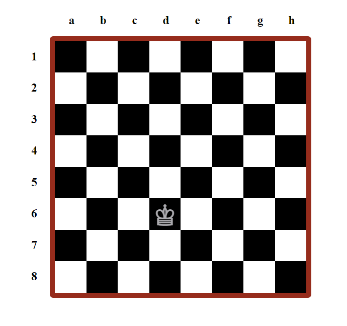

# Chessboard HTML and JavaScript Implementation Description

This implementation showcases a chessboard created using HTML and JavaScript. It features dynamic generation of chessboard blocks and labels, as well as an interactive hovering effect that displays a rhombus.

## Chess Board Overview

